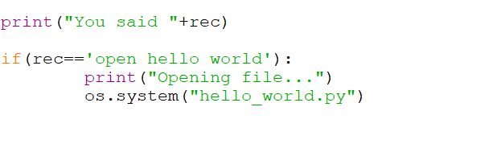

# SpeechRecognition-using-Python (Opening-a-python-program-using-voice-command)
Opens a python program using your custom voice command

## Windows:

  **Python 3.3+ :** 

  **Requirements installation:**

  ```pip install SpeechRecogntion```
  
 ```pip install pyaudio```
  
 ``` pip install pyttsx3```

**Testing SpeechRecognition :**
  
  ```python -m speech_recognition```
  
  **Python 2.6,2.7 :**
 
  **Requirements installation:**

```pip install SpeechRecogntion```
     

```pip install monotonic```
  

```pip install pyaudio```

     	
```pip install pyttsx```


**Testing SpeechRecogntion :**
  
  ```python -m speech_recognition```
  
## Linux:

 **Python 3.3+ :**
 
 Requirements installation:

 **SpeechRecognition:**
 
 ```pip3 install SpeechRecognition```
		
  (OR)

Otherwise, download the source distribution from PyPI, and extract the archive.
In the folder, run 
 
 ```python3 setup.py install.```

**Pyaudio:**
	
```sudo apt-get install python-pyaudio python3-pyaudio```

(OR)

```sudo apt-get install portaudio19-dev python-all-dev python3-all-dev && sudo pip3 install pyaudio```

**Python Text to Speech:**
	
 ```pip3 install pyttsx3(For text to speech)```

**Testing SpeechRecognition:**

```python3 -m speech_recognition```
 
 
 
 **Python 2.6,2.7 :**
 
 Requirements installation:

 1.SpeechRecognition:
 
 ```pip install SpeechRecognition```
		
  (OR)

Otherwise, download the source distribution from PyPI, and extract the archive.
In the folder, run 
 
```python setup.py install.```

2.Pyaudio:
	
 ```sudo apt-get install python-pyaudio python3-pyaudio```
	(OR)

```sudo apt-get install portaudio19-dev python-all-dev python3-all-dev && sudo pip install pyaudio```

3.Python Text to Speech
	
 ```pip3 install pyttsx(For text to speech)```

**Testing SpeechRecognition:**

```python -m speech_recognition```
 
 
 ## Running the program:
   
   From the downloaded /cloned repo directory , open and execute      
   
```speak_here_first.py```
   
   

   Say "open hello world" in the mic , the script then runs ```hello_world.py```  through your voice and you will hear a male-voice speaking something and then the program exits.
   
   
   
## Making modifications:

   > In speak_here_first.py
   
   If you want your program to execute then change the line to the name of the program  you want it to open . (Make sure it is in the same directory as speak_here_first.py or else provide  full path to the filename in your system)
   
   

   > In hello_world.py
   
   If you want your program to speak anything else rather than the default output,
   you can change the text in it to any other string of your choice.
   
   
   
   >In hello_world.py
   
   You can choose a different voice by un-commenting the second
   section of the program.
   
   
   
   >In hello_world.py
   
   You can change the voice to female by removing the comments in the 
   third section.
   
  


